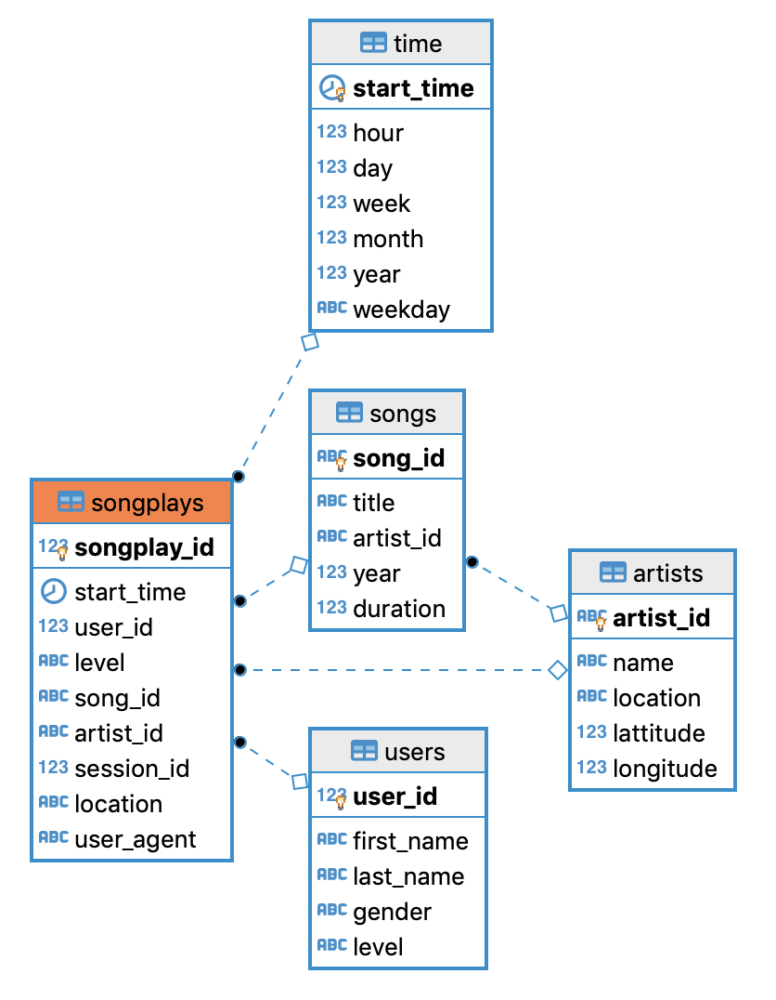

# Data Modeling with Postgres

## **Overview**
In this project, we apply Data Modeling with Postgres and build an ETL pipeline using Python. A startup wants to analyze the data they've been collecting on songs and user activity on their new music streaming app. Currently, they are collecting data in json format and the analytics team is particularly interested in understanding what songs users are listening to.


## **Song Dataset**
Songs dataset is a subset of [Million Song Dataset](http://millionsongdataset.com/).

Sample Record :
```
{"num_songs": 1, "artist_id": "ARJIE2Y1187B994AB7", "artist_latitude": null, "artist_longitude": null, "artist_location": "", "artist_name": "Line Renaud", "song_id": "SOUPIRU12A6D4FA1E1", "title": "Der Kleine Dompfaff", "duration": 152.92036, "year": 0}
```

## **Log Dataset**
Logs dataset is generated by [Event Simulator](https://github.com/Interana/eventsim).

Sample Record :
```
{"artist": null, "auth": "Logged In", "firstName": "Walter", "gender": "M", "itemInSession": 0, "lastName": "Frye", "length": null, "level": "free", "location": "San Francisco-Oakland-Hayward, CA", "method": "GET","page": "Home", "registration": 1540919166796.0, "sessionId": 38, "song": null, "status": 200, "ts": 1541105830796, "userAgent": "\"Mozilla\/5.0 (Macintosh; Intel Mac OS X 10_9_4) AppleWebKit\/537.36 (KHTML, like Gecko) Chrome\/36.0.1985.143 Safari\/537.36\"", "userId": "39"}
```


## Schema

#### Fact Table 
**songplays** - records in log data associated with song plays i.e. records with page `NextSong`

```
songplay_id, start_time, user_id, level, song_id, artist_id, session_id, location, user_agent
```

#### Dimension Tables
**users**  - users in the app
```
user_id, first_name, last_name, gender, level
```
**songs**  - songs in music database
```
song_id, title, artist_id, year, duration
```
**artists**  - artists in music database
```
artist_id, name, location, latitude, longitude
```
**time**  - timestamps of records in  **songplays**  broken down into specific units
```
start_time, hour, day, week, month, year, weekday
```

## Project Files

```sql_queries.py``` -> contains sql queries for dropping and  creating fact and dimension tables. Also, contains insertion query template.

```create_tables.py``` -> contains code for setting up database. Running this file creates **sparkifydb** and also creates the fact and dimension tables.

```etl.py``` -> read and process **song_data** and **log_data**

## **Entity Relationship Diagram**



###How to Run
* ```MODULE_NAME``` = 01_DataModeling_with_Postgres
* ```PACKAGE_NAME``` = com.sampat.de.datamodel.postgres.songs

```Sequence of Execution:```
1. Run the ```create_table.py``` available inside the package .
2. Run the ```etl.py``` file to load and process data for the postgres tables.
