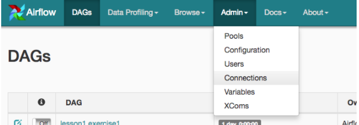
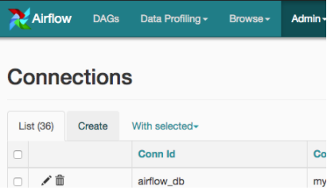
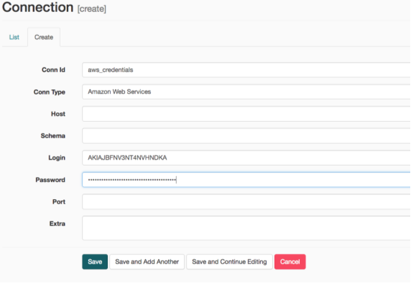
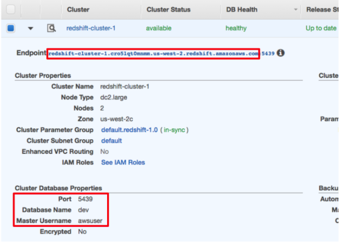
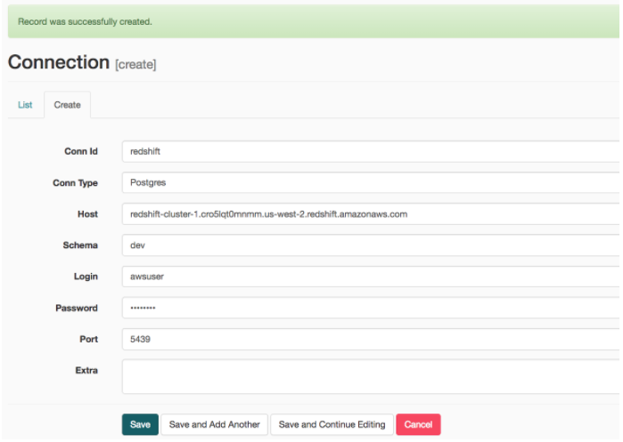

#Add Airflow Connections
Here, we'll use Airflow's UI to configure your AWS credentials and connection to Redshift.

1. To go to the Airflow UI:
    * You can use the Project Workspace here and click on the blue Access Airflow button in the bottom right.
    * If you'd prefer to run Airflow locally, open http://localhost:8080 in Google Chrome (other browsers occasionally have issues rendering the Airflow UI).
2. Click on the Admin tab and select Connections.
    
3. Under ```Connections```, select ```Create```.
    
4. On the create connection page, enter the following values:
    * ```Conn Id:``` Enter ```aws_credentials```
    * ```Conn Type:``` Enter ```Amazon Web Services```
    * ```Login:``` Enter your ```Access key ID``` from the IAM User credentials you downloaded earlier.
    * ```Password:``` Enter your ```Secret access key``` from the IAM User credentials you downloaded earlier.
    
    Once you've entered these values, select Save and Add Another.
    
5. On the next create connection page, enter the following values:
    * ```Conn Id```: Enter ```redshift```.
    * ```Conn Type```: Enter ```Postgres```.
    * ```Host```: Enter the endpoint of your Redshift cluster, excluding the port at the end. You can find this by selecting your cluster in the ```Clusters``` page of the Amazon Redshift console. See where this is located in the screenshot below. IMPORTANT: Make sure to ```NOT``` include the port at the end of the Redshift endpoint string.
    * ```Schema```: Enter ```dev```. This is the Redshift database you want to connect to.
    * ```Login```: Enter ```awsuser```.
    * ```Password```: Enter the password you created when launching your Redshift cluster.
    * ```Port```: Enter ```5439```.

Once you've entered these values, select Save.
    
    
    
Awesome! You're now all configured to run Airflow with Redshift.


#####WARNING: Remember to DELETE your cluster each time you are finished working to avoid large, unexpected costs.

    

